# Poketeams - Full Stack Application

#### Links
Poketeams github repository: [https://github.com/AndrewGregorovic/poketeams-web-T4A2/](https://github.com/AndrewGregorovic/poketeams-web-T4A2/)

Deployed application: [http://www.poketeams.ga/](http://www.poketeams.ga/)

---

## Table of Contents
- [Libraries](#libraries)
- [Testing Methodology](#testing-methodology)
- [Project Management - Part B](#project-management-part-b)
-- [Part A Documentation](#part-a-documentation) --
- [Data Flow Diagram](#data-flow-diagram)
- [Application Architecture Diagram](#application-architecture-diagram)
- [User Stories](#user-stories)
- [Wireframes](#wireframes)
- [Project Management - Part A](#project-management-part-a)

## Libraries

- __bcrypt__: Used for password hashing as it's a slower hashing algorith that provides more resilience to attackers.
- __email-validator__: Used as the validator for email inputs, better than just setting a min length to the text field like some seen in previous lessons.
- __flake8__: Used to help reinforce good coding style and catch and instances where code breaks PEP8 conventions, the max line length can sometimes make code less readable so that particular rule is ignored.
- __Flask__: The web application framework used to build this app using Python.
- __Flask-Login__: Manages login sessions and provides a handy current_user object to help with authentication and authorization in the app.
- __Flask-Migrate__: Used to handle database migrations and keep track of any changes made to the databases structure.
- __Flask-Parameter-Validation__: Used to provide validation on flask route parameters.
- __gunicorn__: The http WSGI server used to run the application with multiple concurrent processes.
- __Jinja2__: The html templating language used to create the templates that form the frontend of the application.
- __marshmallow__: Object serialization/deserialization library used to convert models to and from dictionaries.
- __psycopg2-binary__: The PostgreSQL adaptor used to make the connection to the database from the application.
- __python-dotenv__: Used to load environment variables from a .env file.
- __requests__: Used to make the API requests to pokeapi.co to pull data for the application to consume.
- __requests-cache__: Provides caching functionality to the requests library so that the application complies with the pokeapi.co terms of fair use.
- __SQLAlchemy__: The object relational mapper used to map python object oriented code to SQL commands to interact with the database and prevent against SQL injections.
- __WTForms__: Used to create the forms on the html templates so that users can input data to the application.

## Testing Methodology

To tackle the task of performing an appropriate level of both frontend and backend testing I chose to use a combination of unit testing and manual testing.

With unit testing I split the tests up into what I would consider to be the frontend focused tests and the backend focused tests, keeping them in separate files. The frontend tests are focused on ensuring the correct templates are being rendered with the correct elements while also checking that the status codes of responses is what I am expecting. They also check that redirects take users to the correct page when executed. The backend tests focus more on the actual logic behind the application, dealing with the api data, database models and functions to get the application to function correctly.

In addition to unit testing I performed a set of manual testing in both a development environment once the app had been completed and in a production environment once most of the bugs and issues encountered in the first set of testing had been addressed. These sets of tests looked at performing user actions as both an authenticated user and an anonumous user to try and cover all of the applications endpoints and views.

[Manual Testing Spreadsheet Development](docs/manual_testing_development.xlsx)

[Manual Testing Spreadsheet Production](docs/manual_testing_production.xlsx)

## Project Management - Part B

I continued to use Trello for project management during this part of the assessment, trying to organise and manage the projects development as best I could. The cards are colour coded to indicate different things, (the labels are visible in later screenshots.)

At first I intended to get all of the controller logic done before beginning on the templates as I had very little experience using jinja templating before this assessment and am not fond of frontend development. This ended up not continuing past the second controller as I realised that I needed the templates to ensure that the controller was working correctly and to therefore be able to write unit tests for it. So I adapted my approach to the project by completing the backend controller, frontend templates and unit tests for each controller before moving onto the next.

Regarding the devops side of the assessment, I was late with creating my repo and pushing commits because being the sole developer, I wanted to focus completely on the dev side of the application as it wouldn't affect collaborating with other team members. With deployment, while I was really hoping to have the time to pursue deploying with Terraform, the development time of the application ended up being much longer than I had anticipated with the multiple issues I ran into taking hours each to resolve. In the end I had to fallback to an easier and safer approach to deployment using Heroku to have the project completed and submitted on time.

__25th February__

__28th February__
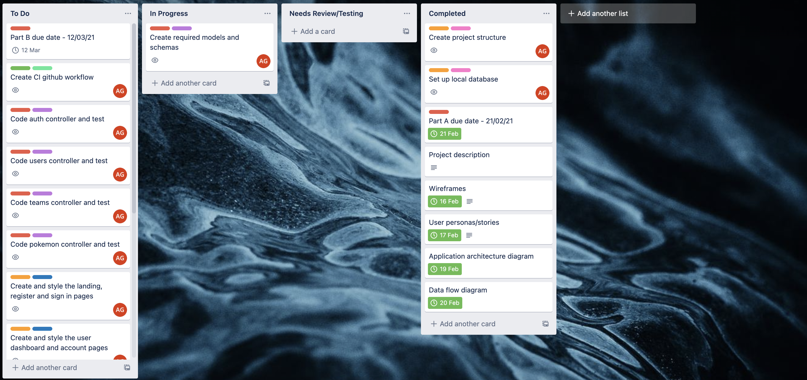
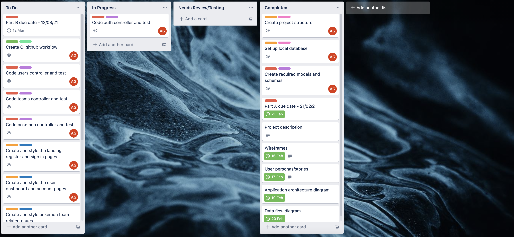
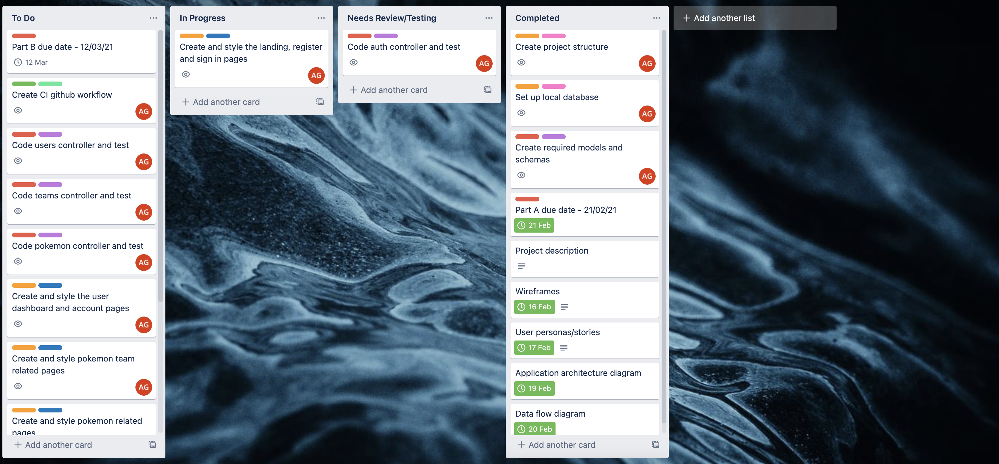

__1st March__
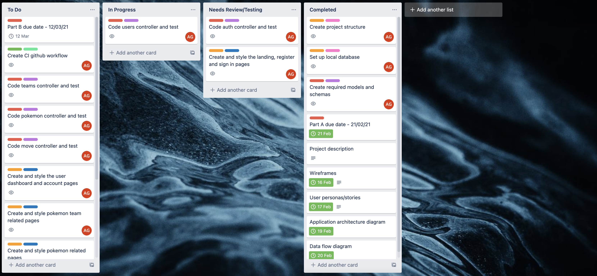

__2nd March__
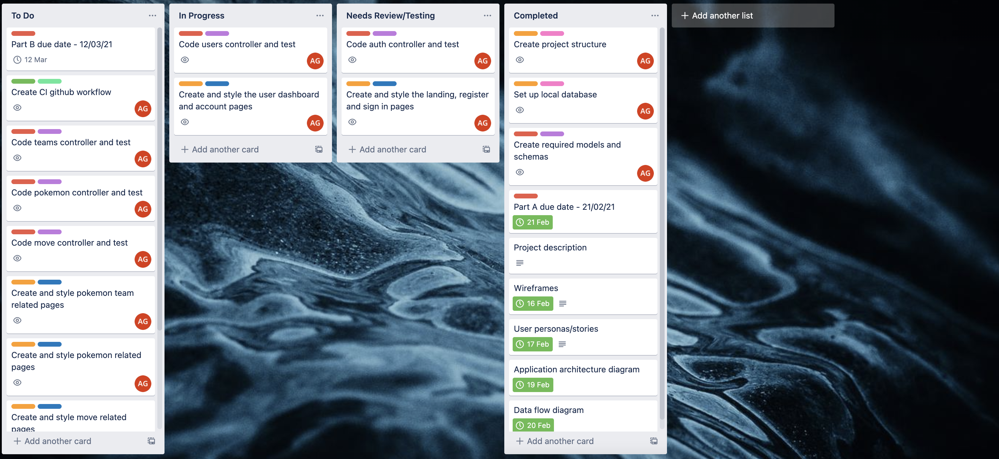

__3rd March__
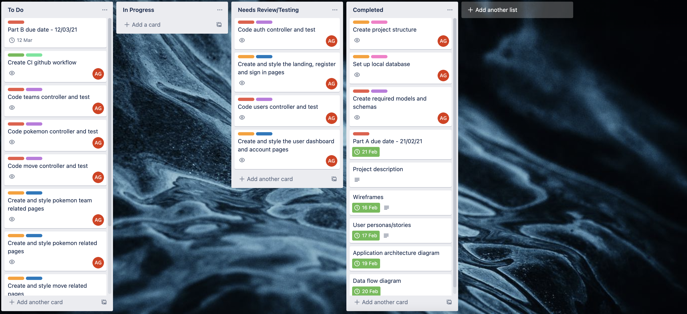

__5th March__
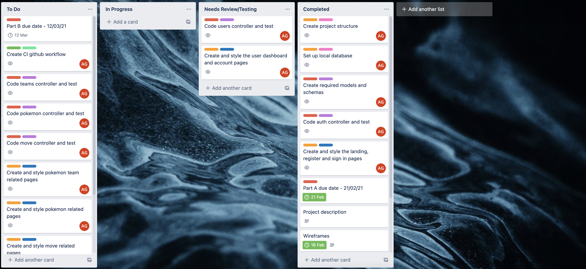

__6th March__
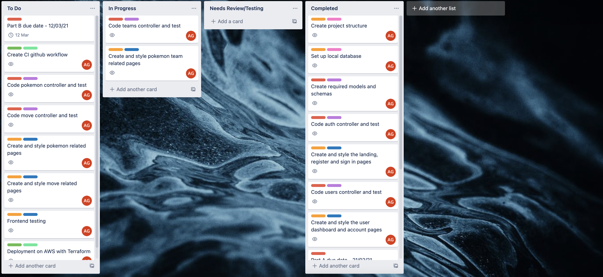

__9th March__
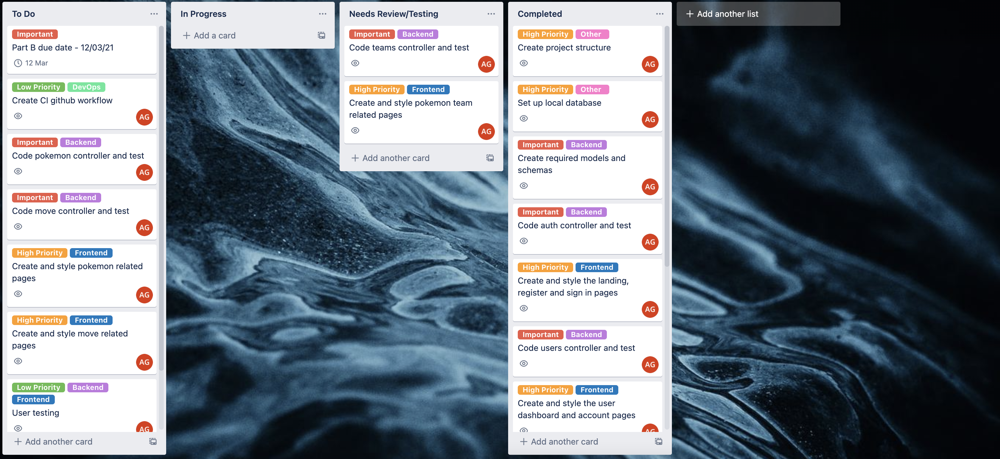

__10th March__
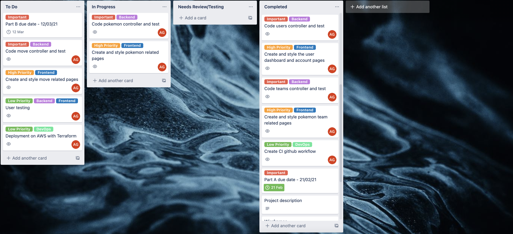

__11th March__
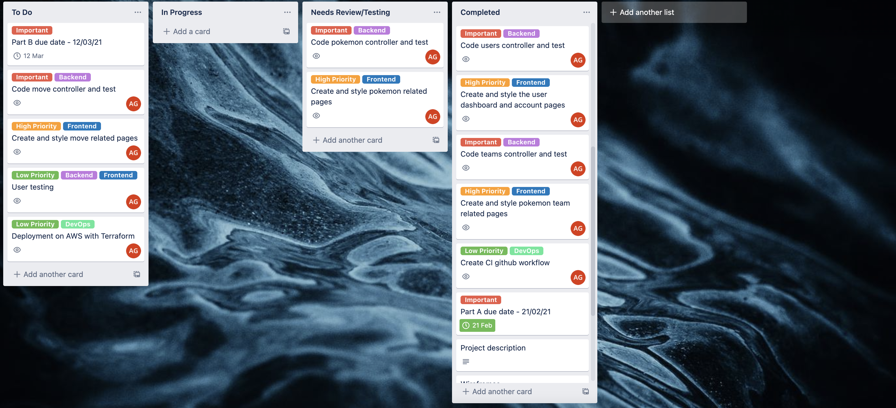
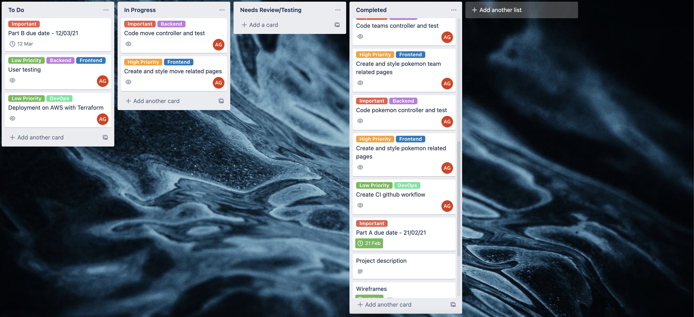
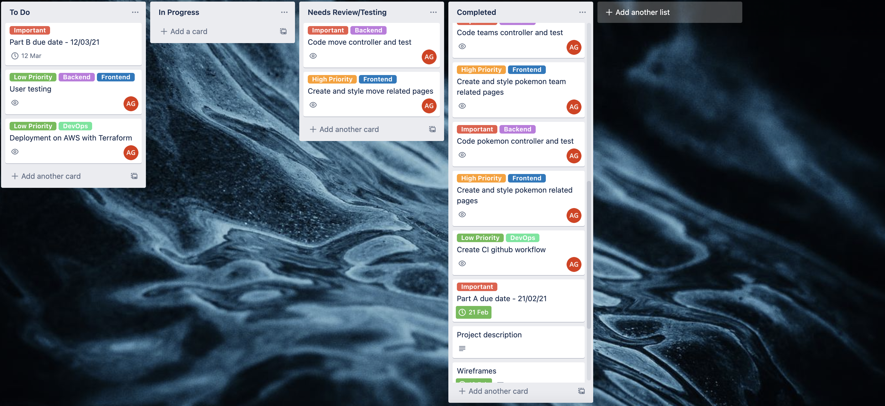

__12th March__

---

## Part A Documentation

### Purpose

The purpose of the Poketeams application is to allow users to create and manage pokemon teams, as well as being able to display all the relevant pokemon and move data. The application pulls all the required data from pokeapi.co, allowing users to:

- Create as many teams as you'd like so that you're never unprepared for a fight.
- Update teams by changing their pokemon or the moves you want those pokemon to know.
- Save teams for later viewing or to continue building if you're interrupted in the middle of creating a new team.
- Delete teams that you no longer need/want.

While the application has been previously developed as a terminal application, it is being recreated as a web application to address the multiple issues and shortcomings that are present in the terminal version of the application.

### Features/Functionality

- Basic account functionality to link pokemon team data to users.
- Ability to view the pokedex entries of pokemon without needing an account or having to create a team.
- Create, update, delete and view pokemon teams.
- Set personal teams to public or private to determine whether other users can view a team.
- Better display of team, pokemon and move information when compared to the terminal application.
- Allows users to interact with the application through a web browser and without needing to install it locally.

### Target Audience

The main target audience for this application are users of the Poketeams terminal application. However, this application can be used by any Pokemon fans who wish to create their own teams or view publicly available teams created by others.

### Tech Stack

The following are the proposed technologies that will be used to develop this full stack application.

__Front-end__
- Jinja templating for the user interface
- HTML as the language used to create the web pages
- Bootstrap CSS to provide the styling for web pages

__Back-end__
- Python as the programming language
- Flask web application framework
- SQLAlchemy ORM to communicate with the database
- Gunicorn for the WSGI server

__Database__
- PostgreSQL for the database management system

__Cloud Services__
- AWS as the cloud platform used to host the app
- AWS Route 53 for DNS service
- Amazon RDS to host the database

__DevOps__
- Docker for creating containers of the application
- Terraform to create and manage the AWS cloud infrastructure for hosting the application

## Data Flow Diagram

## Application Architecture Diagram

>Note: This application architecture diagram is of the deployment I had hoped to achieve with this assessment and does not represent the current deployment.

## User Stories

###### User Personas

|  | Who are they? | What is their main goal? | What is their main concern/barrier to achieving this goal? |
|---|---|---|---|
| Novice Pokemon player persona | A novice at playing the Pokemon games who lacks Pokemon knowledge and sometimes needs help to defeat a tough opponent. | To get assistance with putting together strong teams that can defeat the most difficult opponents. | It can be hard to find multiple good teams online in a single place, and sometimes teams will include Pokemon or moves that may difficult to obtain for a novice. |
| Expert Pokemon player persona | An expert at playing Pokemon games, they have extensive knowledge of Pokemon and like to experiment with different teams. | To share their teams and knowledge with other players and find inspiration for experimenting with new teams of Pokemon. | There's no online resource that makes it easy for people to both build and share their Pokemon teams, there are only sites that do one or the other. |
| Terminal application user persona | A user of the Poketeams terminal application. | To use the Poketeams application without the issues related to using an application that needs to be installed locally and run through a Terminal. | There's currently no other version of the Poketeams application. |

###### User Stories

As a terminal application user, I want to use the application without needing to install it on every computer.

As a terminal application user, I want to have all the team, pokemon and move data display in a way that is more user friendly.

As a terminal application user, I want to be able to access my saved team data without needing to transfer a file between computers.

As a novice pokemon player, I want to be able to view teams made by other people to help me overcome a tough opponent.

As a novice pokemon player, I want to be able to view the data from pokeapi.co in a format that is easier to read.

As a novice pokemon player, I want to be able to create pokemon teams that I can show to other people.

As a novice pokemon player, I want to be able to change and delete teams that I've made.

As an expert pokemon player, I want to be able to create the pokemon teams that I've been successful with to display online.

As an expert pokemon player, I want to be able to view pokemon teams created by other people for inspiration.

###### User Stories (Revised)

As a terminal application user, I want to use the application on any device connected to the internet through a web browser.

As a terminal application user, I want to use the application with a proper graphical interface to improve the display of data and allow for images to be displayed.

As a terminal application user, I want to have an online account so I can access my saved team data from any device that I can use the application on.

As a novice pokemon player, I want to be able to view teams made by other people so that I can try different teams to defeat a difficult opponent without simply following a guide.

As a novice pokemon player, I want to be able to view the data from pokeapi.co in a graphical interface that only shows the important information for each pokemon so that it's easier for me to understand.

As a novice pokemon player, I want to be able to view the data from pokeapi.co along with a picture of the pokemon so that I know I'm looking at the correct pokemon.

As a novice pokemon player, I want to be able to create pokemon teams to show to other people and get advice on the strength/capability of a team to overcome a particular encounter.

As a novice pokemon player, I want to be able to change and delete my teams that weren't successful.

As an expert pokemon player, I want to be able to create the pokemon teams that I've been successful with so that I can share them with other players who might want to copy my team to overcome a difficult fight.

As an expert pokemon player, I want to be able to view pokemon teams made by others to give me ideas and inspiration on new teams I can create to experiment with in the pokemon games.

As an expert pokemon player, I want the ability to make teams private so others can't view them to avoid giving an advantage to potential opponents when participating in pvp battles.

## Wireframes

The application wireframe images for part A of the assessment can be found on the github wiki page linked below.

[https://github.com/AndrewGregorovic/poketeams-web-T4A2/wiki/Wireframes](https://github.com/AndrewGregorovic/poketeams-web-T4A2/wiki/Wireframes)

## Project Management - Part A

The screenshots below have dates and times included to show the development of this documentation over the assessment period. A number of screenshots don't show anything in the In Progress list as I usually moved a new card into the list in the morning then move it to Completed once I have finished the card by the end of the day, and most of these screenshots have been taken at the end of the day as seen by the included times.

The screenshots for project managaing part A of the assessment can be found on the github wiki page linked below.

[https://github.com/AndrewGregorovic/poketeams-web-T4A2/wiki/Project-Management](https://github.com/AndrewGregorovic/poketeams-web-T4A2/wiki/Project-Management)