# Poketeams - Full Stack Application

### Purpose

The purpose of the Poketeams application is to allow users to create and manage pokemon teams, as well as being able to display all the relevant pokemon and move data. The application pulls all the required data from pokeapi.co, allowing users to:

- Create as many teams as you'd like so that you're never unprepared for a fight.
- Update teams by changing their pokemon or the moves you want those pokemon to know.
- Save teams for later viewing or to continue building if you're interrupted in the middle of creating a new team.
- Delete teams that you no longer need/want.

While the application has been previously developed as a terminal application, it is being recreated as a web application to address the multiple issues and shortcomings that are present in the terminal version of the application.

### Features/Functionality

- Basic account functionality to link pokemon team data to users.
- Ability to view the pokedex entries of pokemon without needing an account or having to create a team.
- Create, update, delete and view pokemon teams.
- Set personal teams to public or private to determine whether other users can view a team.
- Better display of team, pokemon and move information when compared to the terminal application.
- Allows users to interact with the application through a web browser and without needing to install it locally.

### Target Audience

The main target audience for this application are users of the Poketeams terminal application. However, this application can be used by any Pokemon fans who wish to create their own teams or view publicly available teams created by others.

### Tech Stack

The following are the proposed technologies that will be used to develop this full stack application.

__Front-end__
- Jinja templating for the user interface
- HTML as the language used to create the web pages
- Bootstrap CSS to provide the styling for web pages

__Back-end__
- Python as the programming language
- Flask web application framework
- SQLAlchemy ORM to communicate with the database
- Gunicorn for the WSGI server

__Database__
- PostgreSQL for the database management system

__Cloud Services__
- AWS as the cloud platform used to host the app
- AWS Route 53 for DNS service
- Amazon RDS to host the database

__DevOps__
- Docker for creating containers of the application
- Terraform to create and manage the AWS cloud infrastructure for hosting the application

---

## Table of Contents
- [Data Flow Diagram](#data-flow-diagram)
- [Application Architecture Diagram](#application-architecture-diagram)
- [User Stories](#user-stories)
- [Wireframes](#wireframes)
- [Project Management Screenshots](#project-management-screenshots)

## Data Flow Diagram

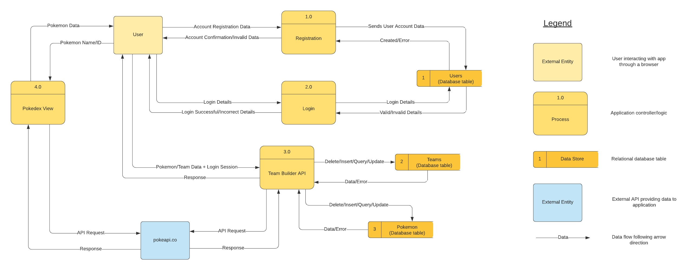

## Application Architecture Diagram

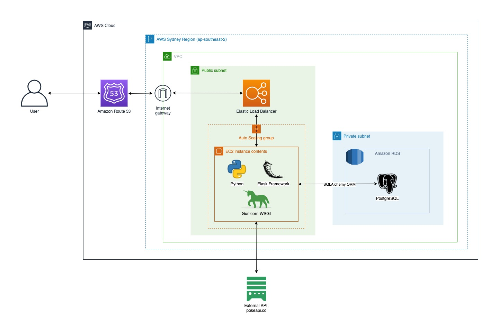

## User Stories

###### User Personas

|  | Who are they? | What is their main goal? | What is their main concern/barrier to achieving this goal? |
|---|---|---|---|
| Novice Pokemon player persona | A novice at playing the Pokemon games who lacks Pokemon knowledge and sometimes needs help to defeat a tough opponent. | To get assistance with putting together strong teams that can defeat the most difficult opponents. | It can be hard to find multiple good teams online in a single place, and sometimes teams will include Pokemon or moves that may difficult to obtain for a novice. |
| Expert Pokemon player persona | An expert at playing Pokemon games, they have extensive knowledge of Pokemon and like to experiment with different teams. | To share their teams and knowledge with other players and find inspiration for experimenting with new teams of Pokemon. | There's no online resource that makes it easy for people to both build and share their Pokemon teams, there are only sites that do one or the other. |
| Terminal application user persona | A user of the Poketeams terminal application. | To use the Poketeams application without the issues related to using an application that needs to be installed locally and run through a Terminal. | There's currently no other version of the Poketeams application. |

###### User Stories

As a terminal application user, I want to use the application without needing to install it on every computer.

As a terminal application user, I want to have all the team, pokemon and move data display in a way that is more user friendly.

As a terminal application user, I want to be able to access my saved team data without needing to transfer a file between computers.

As a novice pokemon player, I want to be able to view teams made by other people to help me overcome a tough opponent.

As a novice pokemon player, I want to be able to view the data from pokeapi.co in a format that is easier to read.

As a novice pokemon player, I want to be able to create pokemon teams that I can show to other people.

As a novice pokemon player, I want to be able to change and delete teams that I've made.

As an expert pokemon player, I want to be able to create the pokemon teams that I've been successful with to display online.

As an expert pokemon player, I want to be able to view pokemon teams created by other people for inspiration.

###### User Stories (Revised)

As a terminal application user, I want to use the application on any device connected to the internet through a web browser.

As a terminal application user, I want to use the application with a proper graphical interface to improve the display of data and allow for images to be displayed.

As a terminal application user, I want to have an online account so I can access my saved team data from any device that I can use the application on.

As a novice pokemon player, I want to be able to view teams made by other people so that I can try different teams to defeat a difficult opponent without simply following a guide.

As a novice pokemon player, I want to be able to view the data from pokeapi.co in a graphical interface that only shows the important information for each pokemon so that it's easier for me to understand.

As a novice pokemon player, I want to be able to view the data from pokeapi.co along with a picture of the pokemon so that I know I'm looking at the correct pokemon.

As a novice pokemon player, I want to be able to create pokemon teams to show to other people and get advice on the strength/capability of a team to overcome a particular encounter.

As a novice pokemon player, I want to be able to change and delete my teams that weren't successful.

As an expert pokemon player, I want to be able to create the pokemon teams that I've been successful with so that I can share them with other players who might want to copy my team to overcome a difficult fight.

As an expert pokemon player, I want to be able to view pokemon teams made by others to give me ideas and inspiration on new teams I can create to experiment with in the pokemon games.

As an expert pokemon player, I want the ability to make teams private so others can't view them to avoid giving an advantage to potential opponents when participating in pvp battles.

## Wireframes

###### Landing Page

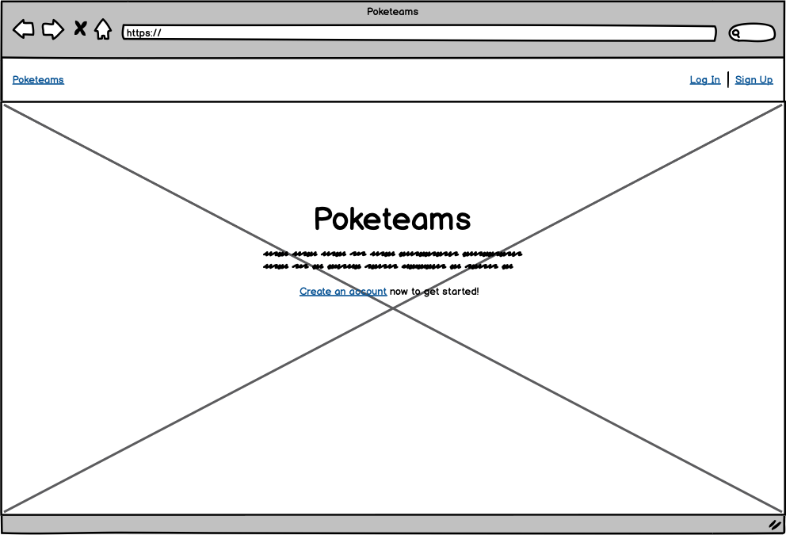

###### Sign Up Page

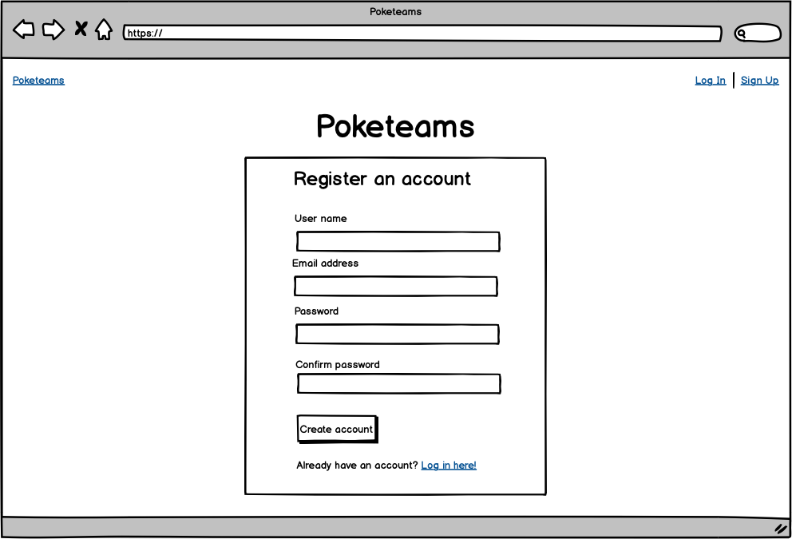

###### Log In Page

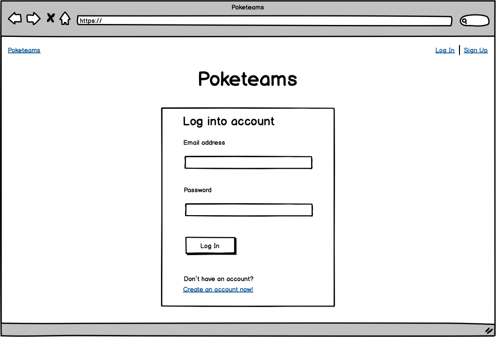

###### User Dashboard Page

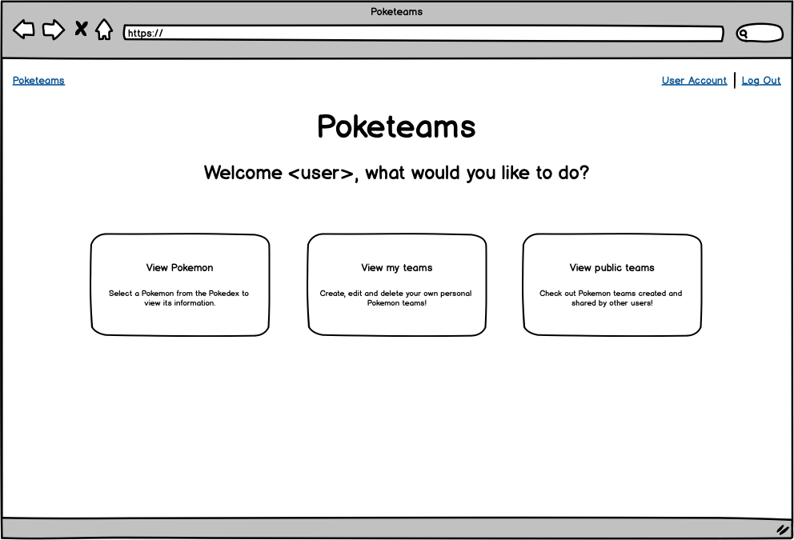

###### User Account Details Page

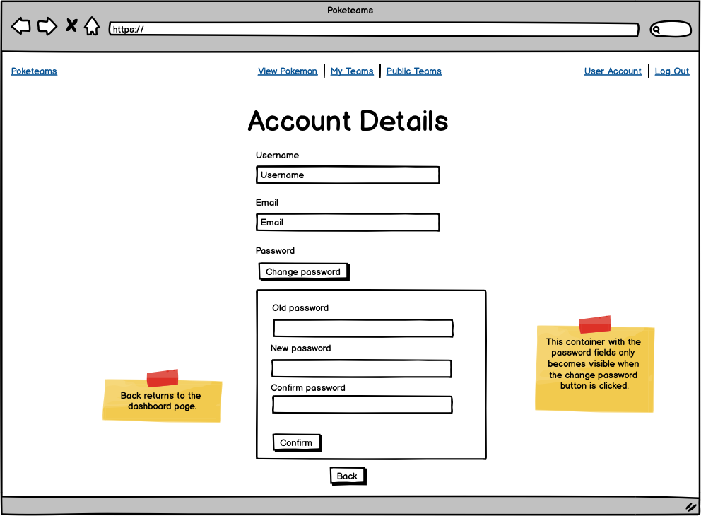

###### View Team List Page

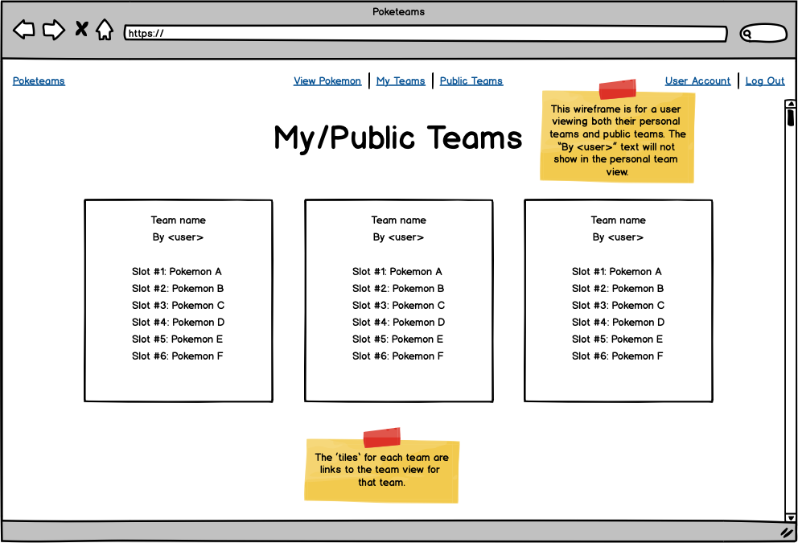

###### View Team Page

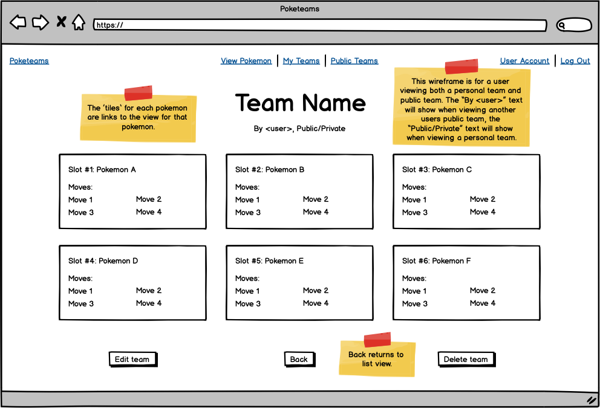

###### Edit Team Page

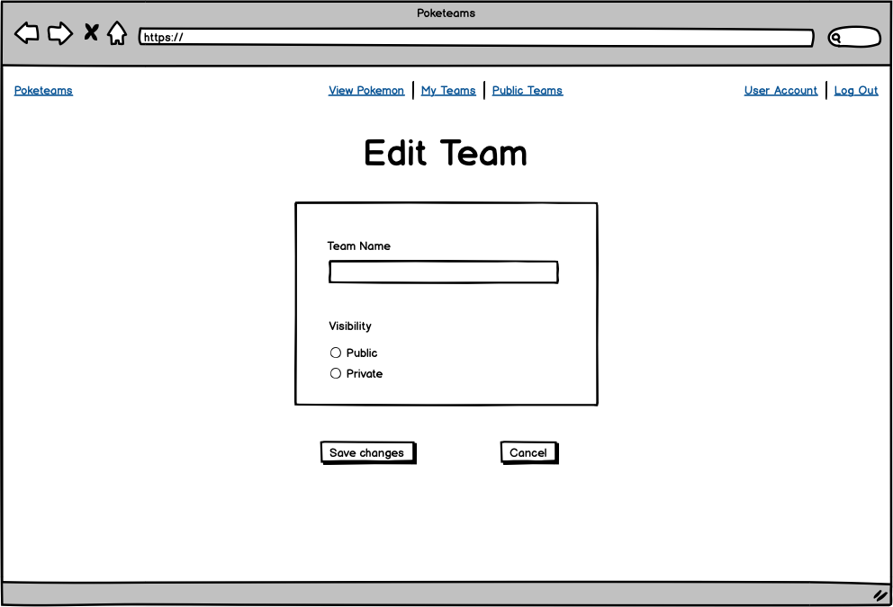

###### View Pokemon Page

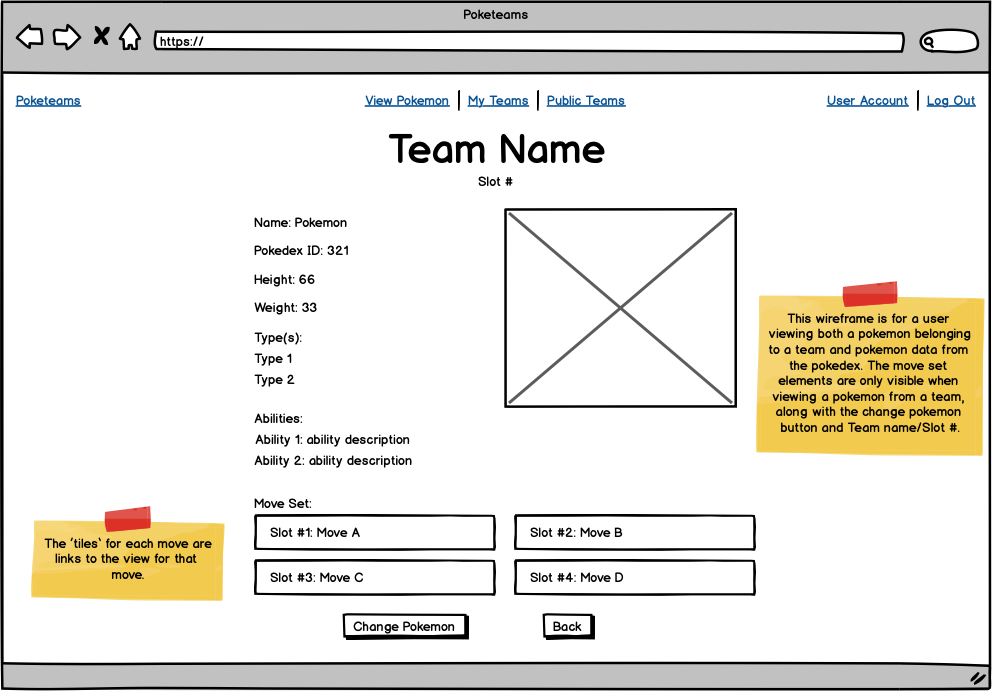

###### View Pokemon List Page

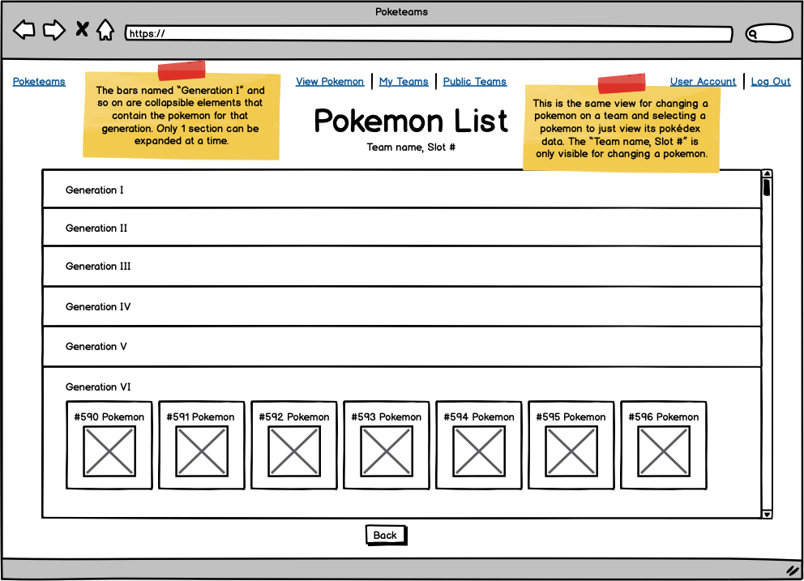

###### View Move Page

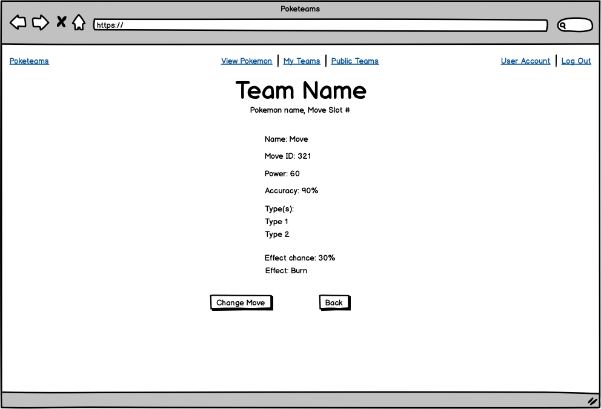

###### View Pokemon Move List Page

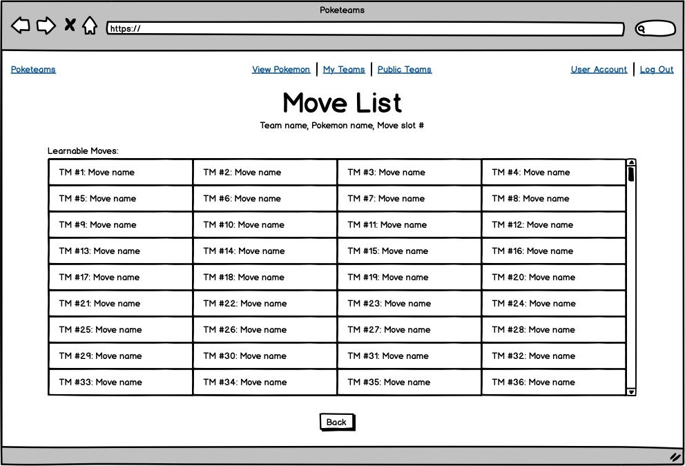

## Project Management Screenshots

The screenshots below have dates and times included to show the development of this documentation over the assessment period. A number of screenshots don't show anything in the In Progress list as I usually moved a new card into the list in the morning then move it to Completed once I have finished the card by the end of the day, and most of these screenshots have been taken at the end of the day as seen by the included times.

###### Friday, Feb 12, 5:17pm

###### Monday, Feb 15, 2:20pm

###### Tuesday, Feb 16, 5:32pm

###### Thursday, Feb 18, 9:30am

###### Thursday, Feb 18, 5:29pm

###### Friday, Feb 19, 5:31pm

###### Saturday, Feb 20, 5:38pm

